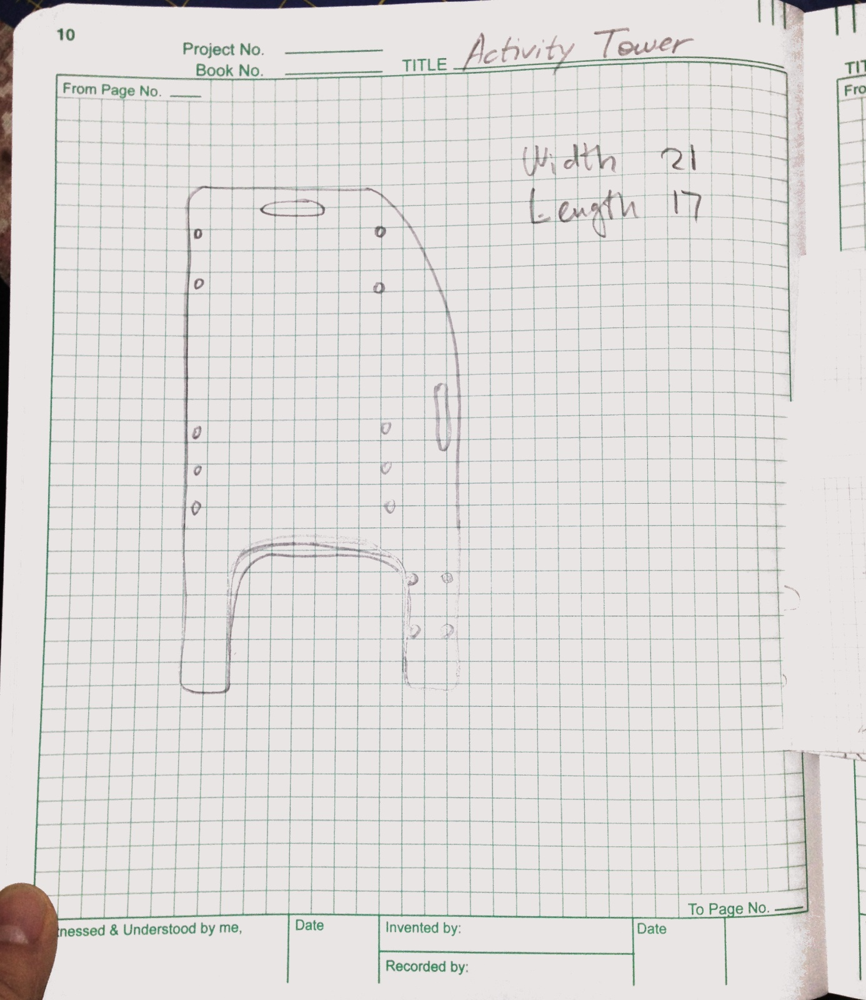
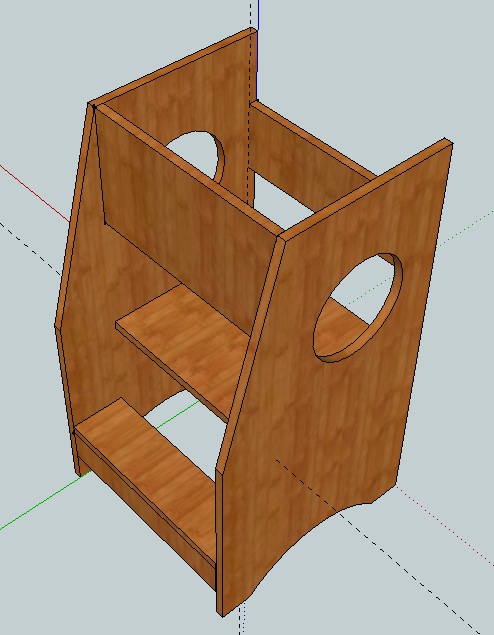
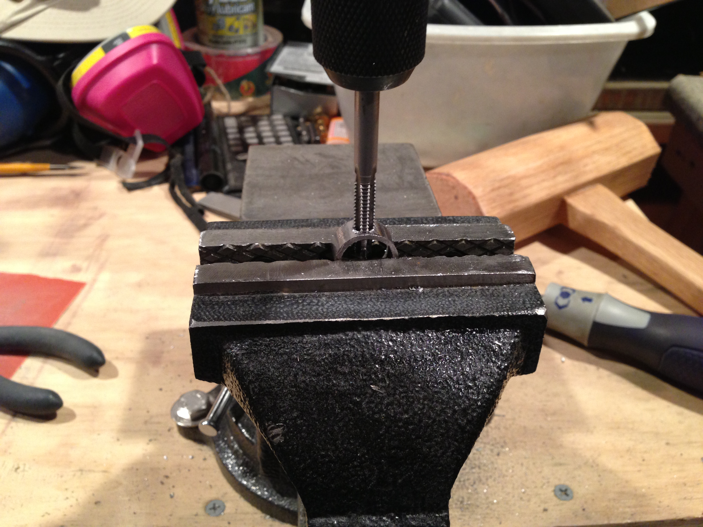
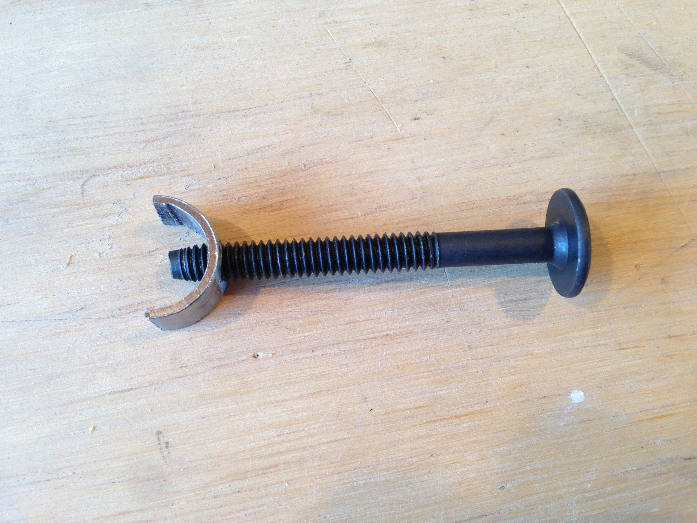
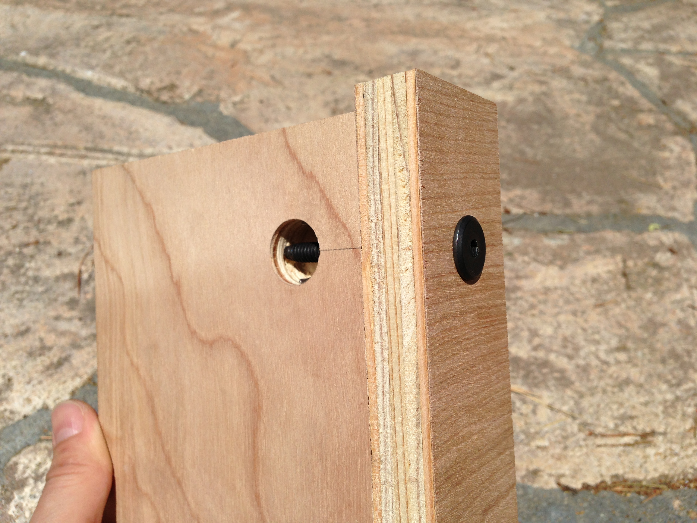
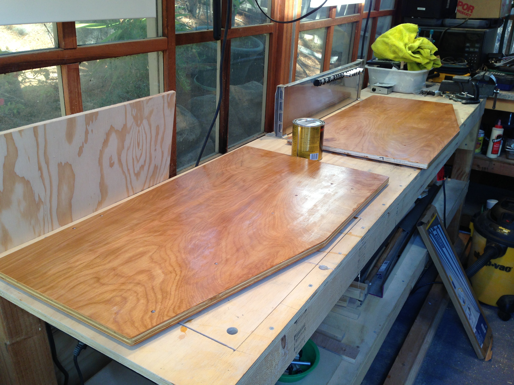
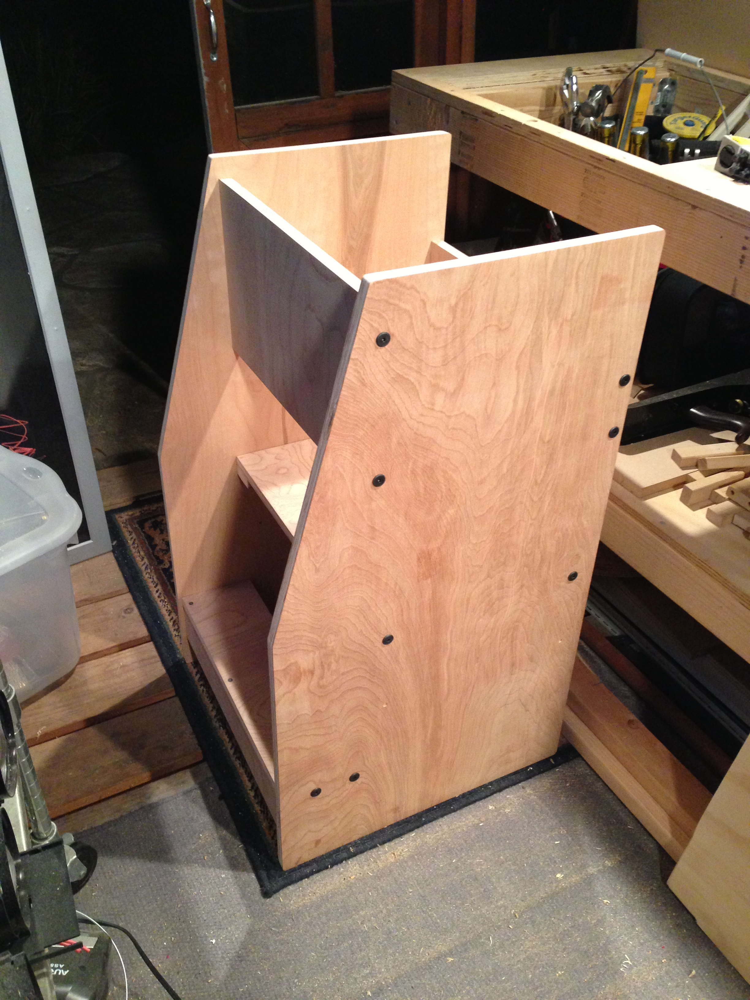
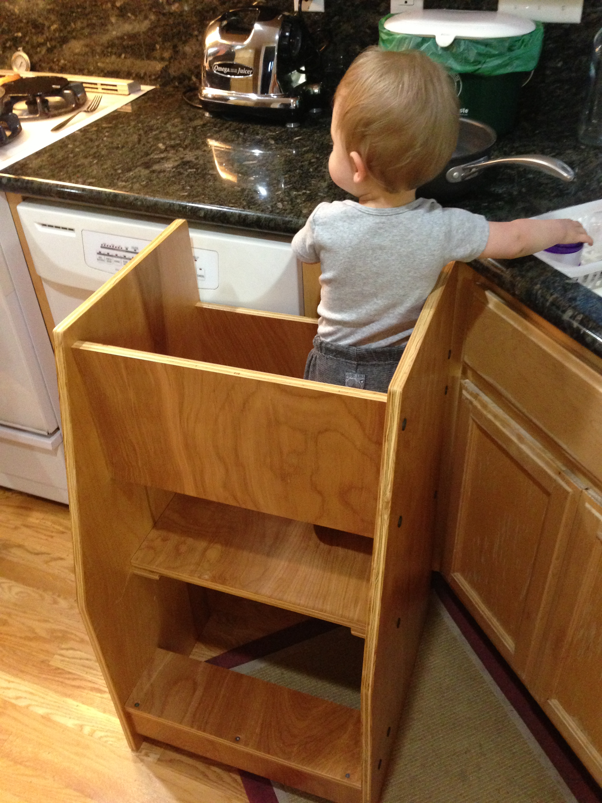

On January 1st, 2012 I sketched an idea—an activity tower for my yet to be born son. Cooking is a big part of our family life, and I wanted my future son to be able to participate in this activity.

The idea was to build the tower out of 3/4-inch plywood, using only a saw and a drill. Here's what I came up with in SketchUp:

I didn't want to use the traditional joinery, like a box joint. I wanted to be able to disassemble and store or transport the tower flat. So I decided to go the Ikea route, and use the bolts to hold the pieces of plywood together.

I already had plenty of bolts, but not the barrel nuts. And instead of ordering the nuts from McMaster-Carr I decided to whip up a home-made version from the materials I had on hand. I happened to have a 3/4-inch steel pipe, so I cut it into the appropriately sized pieces and drilled and tapped the holes for the bolts:

Here's the result:

And here's how it's used to join two pieces of plywood:

After cutting the pieces and sanding the edges, I put a few layers of varnish on everything and let it dry:

A quick assembly and here's the final result:

A few months later, as soon as my son was able to stand on his own, he was helping aroud the kitchen. Here, he's helping me wash the dishes:

